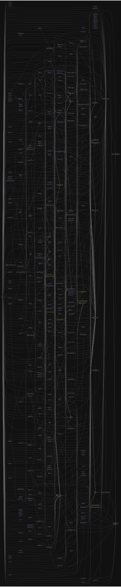

# 源码分析

## 文件结构

``` bash
/Users/liufang/openSource/FunnyLiu/ramda
├── BOOKMARKLET.md
├── CHANGELOG.md
├── CONTRIBUTING.md
├── LICENSE.txt
├── Makefile
├── README.md
├── bower.json
├── dist
|  ├── ramda.js
|  └── ramda.min.js
├── lib
|  ├── bench
|  |  ├── concat.bench.js
|  |  ├── curry.bench.js
|  |  ├── each.bench.js
|  |  ├── either.bench.js
|  |  ├── filter-where.bench.js
|  |  ├── filter.bench.js
|  |  ├── find-where.bench.js
|  |  ├── find.bench.js
|  |  ├── findIndex-where.bench.js
|  |  ├── findIndex.bench.js
|  |  ├── includes.bench.js
|  |  ├── indexof.bench.js
|  |  ├── map.bench.js
|  |  ├── maxWith.bench.js
|  |  ├── propEq.bench.js
|  |  ├── reduce.bench.js
|  |  └── uniq.bench.js
|  └── sauce
|     ├── android.js
|     ├── apple.js
|     ├── browsers.js
|     ├── conf.js
|     ├── ie8-shim.js
|     ├── ios.js
|     ├── linux.js
|     ├── mocharun.js
|     ├── server.js
|     └── windows.js
├── package-lock.json
├── package.json
├── repl
├── rollup.config.js
├── scripts
|  ├── BOOKMARKLET.tmpl.md
|  ├── benchRunner
|  ├── bookmarklet
|  ├── bookmarklet.tmpl.js
|  ├── doc-blob
|  ├── partialBuild.js
|  ├── prepublish
|  └── transpile
|     ├── esm-to-cjs.js
|     └── wrap-constructor-pattern.js
├── source
|  ├── F.js
|  ├── T.js
|  ├── __.js
|  ├── add.js
|  ├── addIndex.js
|  ├── adjust.js
|  ├── all.js
|  ├── allPass.js
|  ├── always.js
|  ├── and.js
|  ├── andThen.js
|  ├── any.js
|  ├── anyPass.js
|  ├── ap.js
|  ├── aperture.js
|  ├── append.js
|  ├── apply.js
|  ├── applySpec.js
|  ├── applyTo.js
|  ├── ascend.js
|  ├── assoc.js
|  ├── assocPath.js
|  ├── binary.js
|  ├── bind.js
|  ├── both.js
|  ├── call.js
|  ├── chain.js
|  ├── clamp.js
|  ├── clone.js
|  ├── comparator.js
|  ├── complement.js
|  ├── compose.js
|  ├── composeWith.js
|  ├── concat.js
|  ├── cond.js
|  ├── construct.js
|  ├── constructN.js
|  ├── converge.js
|  ├── countBy.js
|  ├── curry.js
|  ├── curryN.js
|  ├── dec.js
|  ├── defaultTo.js
|  ├── descend.js
|  ├── difference.js
|  ├── differenceWith.js
|  ├── dissoc.js
|  ├── dissocPath.js
|  ├── divide.js
|  ├── drop.js
|  ├── dropLast.js
|  ├── dropLastWhile.js
|  ├── dropRepeats.js
|  ├── dropRepeatsWith.js
|  ├── dropWhile.js
|  ├── either.js
|  ├── empty.js
|  ├── endsWith.js
|  ├── eqBy.js
|  ├── eqProps.js
|  ├── equals.js
|  ├── evolve.js
|  ├── filter.js
|  ├── find.js
|  ├── findIndex.js
|  ├── findLast.js
|  ├── findLastIndex.js
|  ├── flatten.js
|  ├── flip.js
|  ├── forEach.js
|  ├── forEachObjIndexed.js
|  ├── fromPairs.js
|  ├── groupBy.js
|  ├── groupWith.js
|  ├── gt.js
|  ├── gte.js
|  ├── has.js
|  ├── hasIn.js
|  ├── hasPath.js
|  ├── head.js
|  ├── identical.js
|  ├── identity.js
|  ├── ifElse.js
|  ├── inc.js
|  ├── includes.js
|  ├── index.js
|  ├── indexBy.js
|  ├── indexOf.js
|  ├── init.js
|  ├── innerJoin.js
|  ├── insert.js
|  ├── insertAll.js
|  ├── internal
|  |  ├── _Set.js
|  |  ├── _aperture.js
|  |  ├── _arity.js
|  |  ├── _arrayFromIterator.js
|  |  ├── _assertPromise.js
|  |  ├── _checkForMethod.js
|  |  ├── _clone.js
|  |  ├── _cloneRegExp.js
|  |  ├── _complement.js
|  |  ├── _concat.js
|  |  ├── _createPartialApplicator.js
|  |  ├── _curry1.js
|  |  ├── _curry2.js
|  |  ├── _curry3.js
|  |  ├── _curryN.js
|  |  ├── _dispatchable.js
|  |  ├── _dropLast.js
|  |  ├── _dropLastWhile.js
|  |  ├── _equals.js
|  |  ├── _filter.js
|  |  ├── _flatCat.js
|  |  ├── _forceReduced.js
|  |  ├── _functionName.js
|  |  ├── _functionsWith.js
|  |  ├── _has.js
|  |  ├── _identity.js
|  |  ├── _includes.js
|  |  ├── _includesWith.js
|  |  ├── _indexOf.js
|  |  ├── _isArguments.js
|  |  ├── _isArray.js
|  |  ├── _isArrayLike.js
|  |  ├── _isFunction.js
|  |  ├── _isInteger.js
|  |  ├── _isNumber.js
|  |  ├── _isObject.js
|  |  ├── _isPlaceholder.js
|  |  ├── _isRegExp.js
|  |  ├── _isString.js
|  |  ├── _isTransformer.js
|  |  ├── _isTypedArray.js
|  |  ├── _makeFlat.js
|  |  ├── _map.js
|  |  ├── _objectAssign.js
|  |  ├── _objectIs.js
|  |  ├── _of.js
|  |  ├── _pipe.js
|  |  ├── _pipeP.js
|  |  ├── _quote.js
|  |  ├── _reduce.js
|  |  ├── _reduced.js
|  |  ├── _stepCat.js
|  |  ├── _toISOString.js
|  |  ├── _toString.js
|  |  ├── _xall.js
|  |  ├── _xany.js
|  |  ├── _xaperture.js
|  |  ├── _xchain.js
|  |  ├── _xdrop.js
|  |  ├── _xdropLast.js
|  |  ├── _xdropLastWhile.js
|  |  ├── _xdropRepeatsWith.js
|  |  ├── _xdropWhile.js
|  |  ├── _xfBase.js
|  |  ├── _xfilter.js
|  |  ├── _xfind.js
|  |  ├── _xfindIndex.js
|  |  ├── _xfindLast.js
|  |  ├── _xfindLastIndex.js
|  |  ├── _xmap.js
|  |  ├── _xreduceBy.js
|  |  ├── _xtake.js
|  |  ├── _xtakeWhile.js
|  |  ├── _xtap.js
|  |  └── _xwrap.js
|  ├── intersection.js
|  ├── intersperse.js
|  ├── into.js
|  ├── invert.js
|  ├── invertObj.js
|  ├── invoker.js
|  ├── is.js
|  ├── isEmpty.js
|  ├── isNil.js
|  ├── join.js
|  ├── juxt.js
|  ├── keys.js
|  ├── keysIn.js
|  ├── last.js
|  ├── lastIndexOf.js
|  ├── length.js
|  ├── lens.js
|  ├── lensIndex.js
|  ├── lensPath.js
|  ├── lensProp.js
|  ├── lift.js
|  ├── liftN.js
|  ├── lt.js
|  ├── lte.js
|  ├── map.js
|  ├── mapAccum.js
|  ├── mapAccumRight.js
|  ├── mapObjIndexed.js
|  ├── match.js
|  ├── mathMod.js
|  ├── max.js
|  ├── maxBy.js
|  ├── mean.js
|  ├── median.js
|  ├── memoizeWith.js
|  ├── mergeAll.js
|  ├── mergeDeepLeft.js
|  ├── mergeDeepRight.js
|  ├── mergeDeepWith.js
|  ├── mergeDeepWithKey.js
|  ├── mergeLeft.js
|  ├── mergeRight.js
|  ├── mergeWith.js
|  ├── mergeWithKey.js
|  ├── min.js
|  ├── minBy.js
|  ├── modulo.js
|  ├── move.js
|  ├── multiply.js
|  ├── nAry.js
|  ├── negate.js
|  ├── none.js
|  ├── not.js
|  ├── nth.js
|  ├── nthArg.js
|  ├── o.js
|  ├── objOf.js
|  ├── of.js
|  ├── omit.js
|  ├── on.js
|  ├── once.js
|  ├── or.js
|  ├── otherwise.js
|  ├── over.js
|  ├── pair.js
|  ├── partial.js
|  ├── partialRight.js
|  ├── partition.js
|  ├── path.js
|  ├── pathEq.js
|  ├── pathOr.js
|  ├── pathSatisfies.js
|  ├── paths.js
|  ├── pick.js
|  ├── pickAll.js
|  ├── pickBy.js
|  ├── pipe.js
|  ├── pipeWith.js
|  ├── pluck.js
|  ├── prepend.js
|  ├── product.js
|  ├── project.js
|  ├── prop.js
|  ├── propEq.js
|  ├── propIs.js
|  ├── propOr.js
|  ├── propSatisfies.js
|  ├── props.js
|  ├── range.js
|  ├── reduce.js
|  ├── reduceBy.js
|  ├── reduceRight.js
|  ├── reduceWhile.js
|  ├── reduced.js
|  ├── reject.js
|  ├── remove.js
|  ├── repeat.js
|  ├── replace.js
|  ├── reverse.js
|  ├── scan.js
|  ├── sequence.js
|  ├── set.js
|  ├── slice.js
|  ├── sort.js
|  ├── sortBy.js
|  ├── sortWith.js
|  ├── split.js
|  ├── splitAt.js
|  ├── splitEvery.js
|  ├── splitWhen.js
|  ├── splitWhenever.js
|  ├── startsWith.js
|  ├── subtract.js
|  ├── sum.js
|  ├── symmetricDifference.js
|  ├── symmetricDifferenceWith.js
|  ├── tail.js
|  ├── take.js
|  ├── takeLast.js
|  ├── takeLastWhile.js
|  ├── takeWhile.js
|  ├── tap.js
|  ├── test.js
|  ├── thunkify.js
|  ├── times.js
|  ├── toLower.js
|  ├── toPairs.js
|  ├── toPairsIn.js
|  ├── toString.js
|  ├── toUpper.js
|  ├── transduce.js
|  ├── transpose.js
|  ├── traverse.js
|  ├── trim.js
|  ├── tryCatch.js
|  ├── type.js
|  ├── unapply.js
|  ├── unary.js
|  ├── uncurryN.js
|  ├── unfold.js
|  ├── union.js
|  ├── unionWith.js
|  ├── uniq.js
|  ├── uniqBy.js
|  ├── uniqWith.js
|  ├── unless.js
|  ├── unnest.js
|  ├── until.js
|  ├── update.js
|  ├── useWith.js
|  ├── values.js
|  ├── valuesIn.js
|  ├── view.js
|  ├── when.js
|  ├── where.js
|  ├── whereAny.js
|  ├── whereEq.js
|  ├── without.js
|  ├── xor.js
|  ├── xprod.js
|  ├── zip.js
|  ├── zipObj.js
|  └── zipWith.js
└── testem.json

directory: 11 file: 641

ignored: directory (1)

```

## 外部模块依赖

请在： http://npm.broofa.com?q=ramda 查看

## 内部模块依赖


  